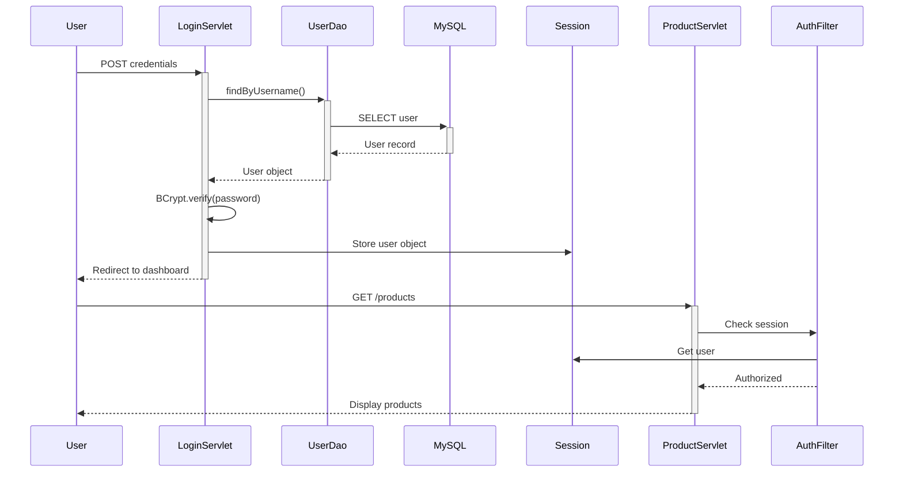

# Architecture Overview

This document describes the high-level architecture and design decisions for the eBay Auction Platform.

## Architectural Style

The application follows a **monolithic, layered architecture** with server-side rendering:

- **Monolithic web application** - Single deployable WAR file
- **Layered architecture** - Clear separation between presentation, business logic, and data access
- **Server-side rendering** - JSP for dynamic HTML generation

## System Diagram

```
┌─────────────────────────────────────────────┐
│           Browser (Client)                  │
└─────────────────┬───────────────────────────┘
                  │ HTTP
                  ↓
┌─────────────────────────────────────────────┐
│      Servlet Container (Tomcat)             │
│  ┌────────────────────────────────────────┐ │
│  │  Filters (Auth, CORS, etc.)            │ │
│  └──────────────┬─────────────────────────┘ │
│                 ↓                            │
│  ┌────────────────────────────────────────┐ │
│  │  Servlets (Controllers)                │ │
│  │  - LoginServlet                        │ │
│  │  - CreateProductServlet                │ │
│  │  - BidServlet                          │ │
│  │  - AdminDashboardServlet               │ │
│  └──────────────┬─────────────────────────┘ │
│                 ↓                            │
│  ┌────────────────────────────────────────┐ │
│  │  JSP Views (Presentation)              │ │
│  └────────────────────────────────────────┘ │
└─────────────────┬───────────────────────────┘
                  │ JDBC
                  ↓
┌─────────────────────────────────────────────┐
│  DAO Layer (Data Access Objects)            │
│  - UserDao                                  │
│  - ProductDao                               │
│  - BidDao                                   │
│  - StatsDao                                 │
└─────────────────┬───────────────────────────┘
                  │ SQL
                  ↓
┌─────────────────────────────────────────────┐
│         MySQL Database                      │
│  Tables: users, products, departments, bids │
└─────────────────────────────────────────────┘
```

## Layers

### 1. Presentation Layer (JSP)

Located in `src/main/webapp/WEB-INF/jsp/`

**Responsibilities:**
- Render HTML based on model data
- Display forms and user interfaces
- No business logic or direct database access

**Key Views:**
- `auth/login.jsp`, `auth/register.jsp`
- `product/create.jsp`, `product/list.jsp`
- `admin/dashboard.jsp`, `admin/users.jsp`

### 2. Controller Layer (Servlets)

Located in `src/main/java/com/nettenz/ebay/servlet/`

**Responsibilities:**
- Handle HTTP requests and responses
- Perform validation and authorization checks
- Orchestrate business logic
- Delegate persistence to DAO classes
- Forward to appropriate JSP views

**Examples:**
- `LoginServlet` - Handles authentication
- `CreateProductServlet` - Product creation logic
- `BidServlet` - Bidding operations
- `AdminDashboardServlet` - Admin statistics

### 3. Filter Layer

Located in `src/main/java/com/nettenz/ebay/filter/`

**Responsibilities:**
- Cross-cutting concerns (authentication, logging, CORS)
- Intercept requests before they reach servlets
- Enforce security policies

**Key Component:**
- `AuthFilter` - Session validation and role-based authorization

### 4. Data Access Layer (DAO)

Located in `src/main/java/com/nettenz/ebay/dao/`

**Responsibilities:**
- Encapsulate all SQL logic
- Use JDBC with PreparedStatements
- Prevent SQL injection
- Provide clean API for data operations

**Examples:**
- `UserDao` - User CRUD operations
- `ProductDao` - Product management
- `BidDao` - Bidding operations
- `StatsDao` - Dashboard statistics

### 5. Database Layer

**Technology:** MySQL 8.x

**Core Tables:**
- `users` - User accounts with roles
- `products` - Auction listings
- `departments` - Product categories
- `bids` - Bid history and tracking

See [Database Schema](database/schema.md) for details.

## Authentication Flow



1. User submits credentials
2. `LoginServlet` queries database via `UserDao`
3. Password verified via BCrypt
4. User object stored in HTTP session
5. Subsequent requests checked by `AuthFilter`
6. Role-based access enforced (USER vs ADMIN)

## Image Handling

**Upload Flow:**
1. Multipart form data received by `CreateProductServlet`
2. Files stored on disk in `uploads/` directory
3. Image path saved to database
4. Images served through `ImageServlet`

**External URLs:**
- Supports external image URLs as fallback
- Validated before storage

## Bidding Engine

**Current Implementation:**
- `BidDao` for bid persistence and queries
- `BidServlet` for bid placement
- Highest bid tracking per product
- Bid history display

**Planned Enhancements:**
- Transaction-safe bid validation
- Concurrent bid handling
- Bid increment rules
- Reserve pricing
- Auto-close on auction end

See [Bidding Features](features/bidding.md) for details.

## Security Architecture

### Current Implementation

✅ **Password Security**
- BCrypt hashing with 12 rounds
- Salted and stored securely

✅ **SQL Injection Prevention**
- PreparedStatements for all queries
- No string concatenation in SQL

✅ **Session Management**
- HTTP sessions for authentication state
- Role-based access control

### Planned Improvements

- 🔄 CSRF tokens for state-changing operations
- 🔄 HTTPS enforcement
- 🔄 Input sanitization (XSS prevention)
- 🔄 Rate limiting on auth endpoints
- 🔄 Audit logging for admin actions

See [Security Guide](security.md) for details.

## Deployment Architecture

**Build Process:**
```bash
Maven → JAR dependencies + WAR packaging → Tomcat deployment
```

**Runtime:**
- Apache Tomcat 10.1+ (Servlet Container)
- MySQL 8.x (Database Server)
- File system (Image uploads)

**Configuration:**
- Database credentials (currently hardcoded)
- Upload paths (configurable)
- Session timeout settings

See [Deployment Guide](deployment.md) for production setup.

## Future Evolution

### Short-term
- Auction closing scheduler (cron/timer)
- Enhanced bid validation
- Environment-based configuration

### Long-term
- REST API layer
- SPA frontend (React/Vue)
- Microservices architecture
- Cloud deployment (AWS/Azure)
- Real-time bidding with WebSockets

## Design Patterns Used

- **MVC** (Model-View-Controller) - Servlet/JSP separation
- **DAO** (Data Access Object) - Database abstraction
- **Factory** - Database connection management
- **Filter Chain** - Request interception
- **Session Facade** - User state management
